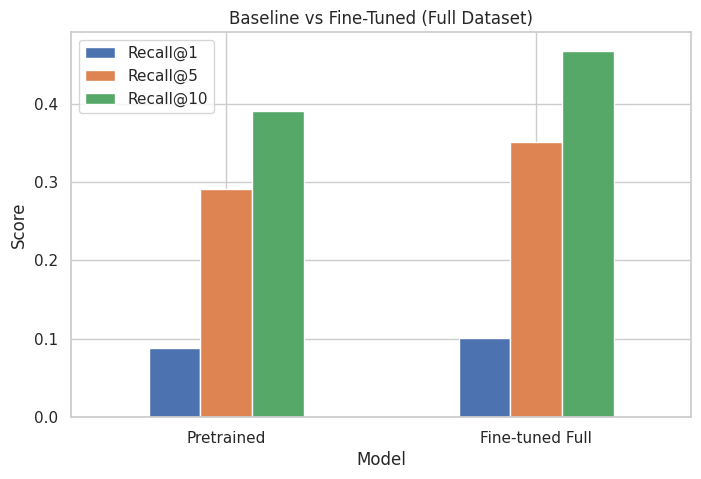

# Multimodal AI: CLIP Fine-tuning for Image–Text Retrieval

A PyTorch-based research project for fine-tuning OpenAI’s CLIP (ViT-B/32) on the COCO dataset using LoRA (Low-Rank Adaptation) to improve image–text retrieval performance.

This project focuses on efficient adaptation of large multimodal models under limited GPU resources (8GB VRAM).

---

# 📌 What This Project Is (And Is Not)

✅ This project performs **image–text retrieval**
❌ It does NOT generate captions (CLIP is not a generative model)

Given an image, the model retrieves the most semantically aligned caption from a candidate pool using cosine similarity in embedding space.

---

# 📋 Project Overview

This project implements:

* 🔹 LoRA-based parameter-efficient fine-tuning of CLIP
* 🔹 Two experimental pipelines:

  * 20K image subset
  * Full COCO dataset
* 🔹 Contrastive learning using InfoNCE loss
* 🔹 Quantitative evaluation using retrieval metrics
* 🔹 Qualitative comparison across models
* 🔹 Memory-efficient embedding precomputation
* 🔹 Early stopping and checkpoint management

---

# 🧠 Problem Formulation

We frame this as a **bidirectional retrieval task**:

Given:

* Image embedding ( v_i )
* Text embedding ( t_j )

Similarity:

[
sim(i, j) = \frac{v_i \cdot t_j}{||v_i|| ||t_j||}
]

Training objective:

Contrastive InfoNCE loss over image–text pairs.

---

# 🗂️ Directory Structure

```
multimodal_ai/
├── .gitignore                          # Git ignore rules
├── .python-version                     # Python version specification
├── pyproject.toml                      # Project dependencies and metadata
├── README.md                           # This file
├── approach.md                         # Project approach documentation
│
├── data/                               # Dataset directory
│   ├── COCO/                           # COCO 2014 dataset
│   │   ├── train2014/                  # Training images
│   │   ├── val2014/                    # Validation images
│   │   └── annotations/                # COCO annotations
│   │       ├── captions_train2014.json
│   │       ├── captions_val2014.json
│   │       ├── instances_train2014.json
│   │       ├── instances_val2014.json
│   │
│   └── processed/                      # Processed dataset CSVs
│       ├── coco_full_data.csv          # Full COCO dataset
│       ├── coco_train_20k.csv          # 20K subset training split
│       ├── coco_val_20k.csv            # 20K subset validation split
│       ├── coco_train_full.csv         # Full dataset training split
│       └── coco_val_full.csv           # Full dataset validation split
│
├── checkpoints/                        # 20K model checkpoints
├── checkpoints_full/                   # Full dataset model checkpoints
│
├── notebooks/                          # Jupyter notebooks
│   ├── coco_eda.ipynb                  # Exploratory data analysis
│   ├── preprocessing.ipynb             # Data preprocessing pipeline
│   ├── training_sample.ipynb           # Training sample creation
│   ├── qualitative_caption_retrieval.ipynb           # Caption retrieval demo
│   ├── baseline_vs_finetuned_evaluation_20k.ipynb    # 20K evaluation
│   └── baseline_vs_fine_tuned_full.ipynb             # Full evaluation
│
└── src/                                # Source code
    ├── dataset.py                      # COCO dataset class
    ├── trainer.py                      # CLIPTrainer class
    ├── train_clip.py                   # Training script (20K subset)
    └── train_clip_full.py              # Training script (full dataset)
```

---

# 🔬 Experimental Setup

### Model

* Base: `openai/clip-vit-base-patch32`
* Vision encoder: Frozen
* Text encoder: LoRA-adapted

### LoRA Configuration

* Rank (r): 8
* Alpha: 16
* Target layers: `q_proj`, `v_proj`
* Dropout: 0.1
* Bias: None

### Training Details

| Setting        | 20K Model | Full Model |
| -------------- | --------- | ---------- |
| Batch size     | 32        | 32         |
| Learning rate  | 5e-5      | 2e-5       |
| Epochs         | 20        | 10         |
| Early stopping | Yes       | Yes        |
| Optimizer      | AdamW     | AdamW      |

---

# 🖥️ Hardware

* GPU: RTX 4060 (8GB VRAM)
* RAM: 16GB
* OS: Arch Linux
* Python: 3.11

LoRA was chosen specifically to fit full COCO fine-tuning within 8GB VRAM constraints.

---

# 📊 Quantitative Results


## 20k Subset Evaluation

| Model             | Recall@1  | Recall@5  | Recall@10 | MRR       |
| ----------------- | --------- | --------- | --------- | --------- |
| Pretrained        | 0.403     | 0.735    | 0.833     | 0.552     |
| Fine-tuned (20k subset) | **0.471** | **0.816** | **0.899** | **0.623** |

---

## Full Dataset Evaluation

| Model             | Recall@1  | Recall@5  | Recall@10 | MRR       |
| ----------------- | --------- | --------- | --------- | --------- |
| Pretrained        | 0.088     | 0.291     | 0.390     | 0.186     |
| Fine-tuned (Full) | **0.101** | **0.350** | **0.467** | **0.218** |

### Observations

* +1.3% absolute improvement in Recall@1
* +6% improvement in Recall@5
* +7.7% improvement in Recall@10
* Improved ranking consistency (MRR)

Fine-tuned full model consistently outperformed both:

* Pretrained baseline
* 20K subset model

---


## Visual Comaprison

 

---

# 🧪 Qualitative Evaluation

Qualitative testing included:

* Random COCO validation images
* Completely out-of-distribution internet images
* Random test folder images

Observations:

* Full fine-tuned model retrieved more specific captions
* 20K model sometimes showed mild overfitting
* Pretrained CLIP was more generic but stable
* Full model demonstrated better contextual awareness

---

# 📓 Notebook Breakdown

## 1️⃣ `coco_eda.ipynb`

* Loads COCO annotations
* Inspects caption distribution
* Computes vocabulary size
* Detects duplicate captions
* Analyzes dataset structure

Purpose:
Understand dataset properties before training.

---

## 2️⃣ `preprocessing.ipynb`

* Parses COCO JSON annotations
* Builds image–caption CSV format
* Removes structural inconsistencies
* Generates:

  * `coco_full_data.csv`
  * 20K subset splits
  * Full dataset splits

Purpose:
Prepare clean training-ready dataset.

---

## 3️⃣ `training_sample.ipynb`

* Subset selection logic
* 20K image sampling
* Train/validation split creation

Purpose:
Controlled experiment on smaller subset.

---

## 4️⃣ `baseline_vs_finetuned_evaluation_20k.ipynb`

* Loads pretrained & 20K model
* Computes embeddings
* Evaluates retrieval metrics
* Generates comparison table

---

## 5️⃣ `baseline_vs_fine_tuned_full.ipynb`

* Same evaluation pipeline
* Full dataset comparison
* Reports Recall@K and MRR

---

## 6️⃣ `qualitative_caption_retrieval.ipynb`

* Loads all three models
* Precomputes text embeddings
* Tests:

  * Random COCO images
  * External images
* Demonstrates retrieval results visually

Purpose:
Human-level qualitative validation.

---

# 🏗️ Source Code Explanation

## `dataset.py`

Implements `CocoCLIPDataset`

Responsibilities:

* Loads CSV
* Opens images
* Applies CLIP processor
* Returns tokenized text + image tensors

---

## `trainer.py`

Implements `CLIPTrainer`

Handles:

* Forward pass
* Contrastive loss computation
* Validation Recall@1
* Early stopping
* Checkpointing (best & last only)
* Metric logging

---

## `train_clip.py`

* 20K subset training
* Applies LoRA
* Saves metrics to CSV

---

## `train_clip_full.py`

* Full COCO training
* Uses lower LR
* Optimized for memory stability

---

# ⚡ Memory Optimization Strategy

To avoid GPU OOM:

* Text embeddings computed in batches
* Embeddings moved to CPU
* Similarity computed on CPU
* Only image embedding remains on GPU

This enabled full-dataset evaluation on 8GB VRAM.

---

# 🧠 Why LoRA Instead of Full Fine-Tuning?

Full backbone fine-tuning:

* Exceeded VRAM
* Required significantly more compute
* Risked catastrophic forgetting

LoRA provided:

* Parameter-efficient adaptation
* Stable convergence
* Minimal GPU overhead
* Faster training

---

# 🎯 Key Insights

1. LoRA improved retrieval performance.
2. Full dataset fine-tuning generalized better than small subset.
3. Even small Recall@1 improvements are meaningful at scale.
4. Retrieval performance scales with caption diversity.
5. CLIP benefits more from broader dataset exposure than higher LR.

---

# 🚧 Limitations

* CLIP does not generate novel captions.
* Evaluation limited to image-to-text direction.
* No text-to-image retrieval metrics included.
* No hard negative mining.
* No domain adaptation beyond COCO.

---

# 🚀 Future Improvements

* Add text-to-image retrieval evaluation
* Implement hard negative mining
* Try LoRA on vision encoder
* Try larger CLIP variants (ViT-L/14)
* Compare against BLIP
* Add embedding visualization (UMAP / t-SNE)
* Add zero-shot classification benchmarks

---

# 📦 Reproducibility

To fully reproduce:

1. Download COCO 2014
2. Run `preprocessing.ipynb`
3. Run training script
4. Run evaluation notebook

Random seeds are fixed where applicable.

---

# 📄 License

COCO dataset subject to its official terms.
CLIP model under OpenAI license.
Project intended for academic and research use.

---

# 🎓 Learning Outcomes

This project demonstrates:

* Efficient multimodal fine-tuning
* Retrieval evaluation methodology
* GPU memory optimization
* LoRA integration with Transformers
* Research-grade experimentation workflow

---
